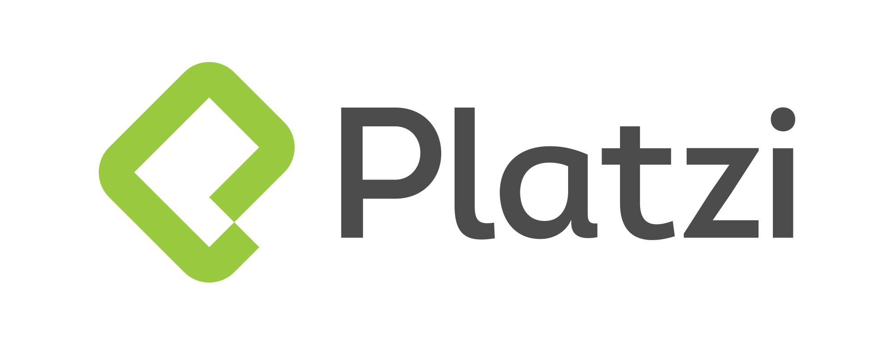
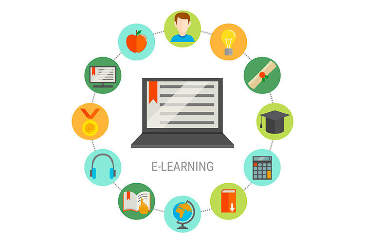
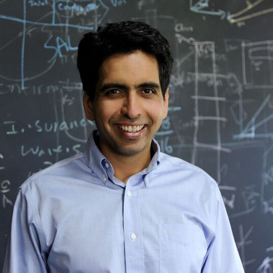
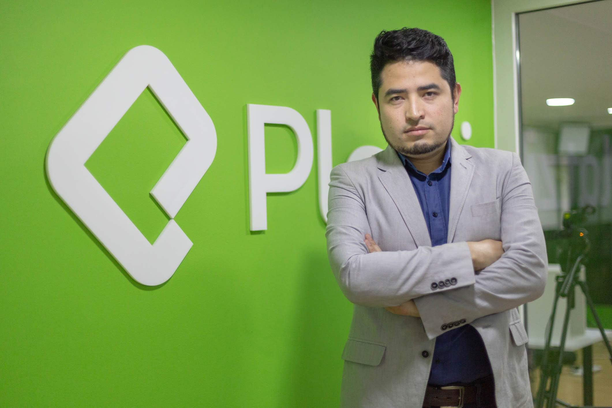
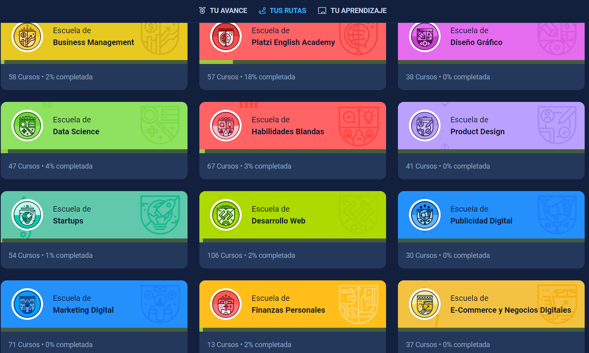
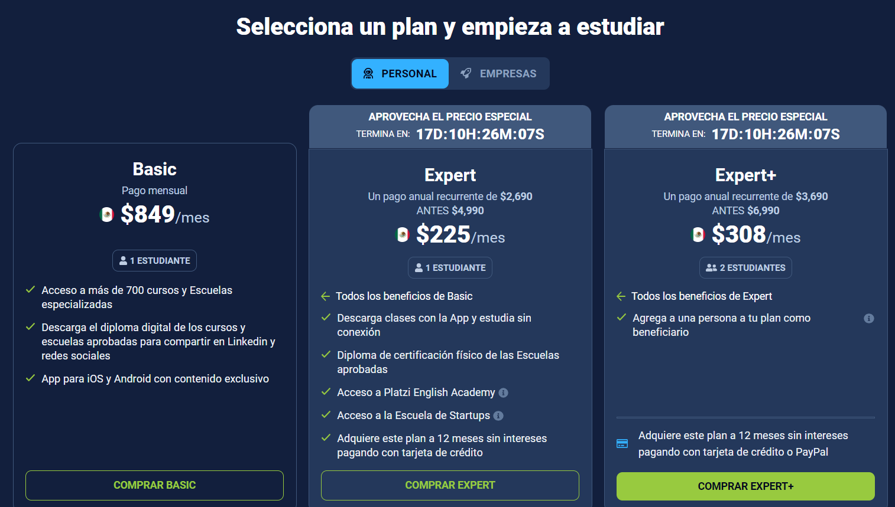
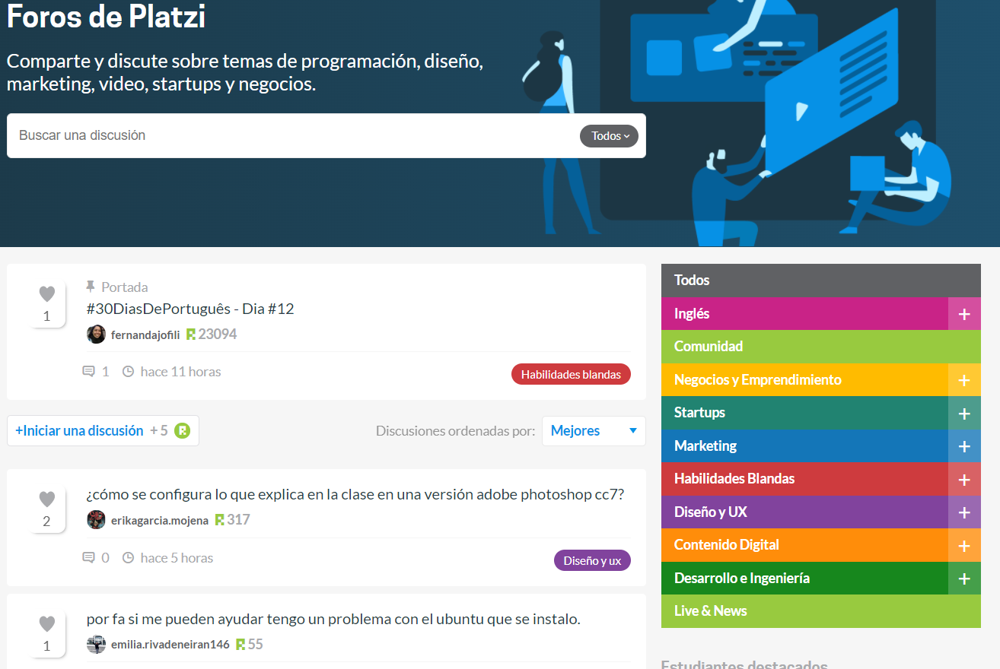
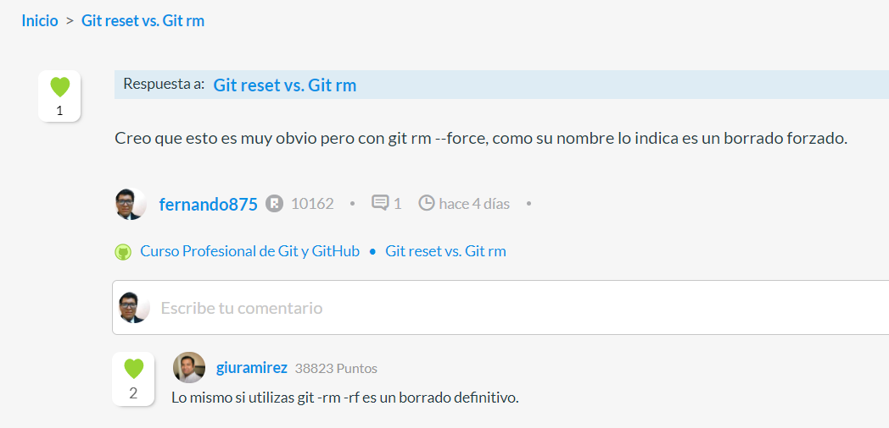

# La Historia de Platzi Escrito

# Introducción

Vamos a hablar de una de las historias de las plataformas de eLearning que ha ganado más popularidad en los recientes años.

 

# ¿Qué es un eLearning?

Antes de empezara a hablar de Platzi hablemos de que es un eLearning. 

Cuando tenemos una "e" antes de una palabra en ingles (eBook, eCommerce, eLearning) hace referencia a la palabra electronic, y la palabra Learning es la conjugación en Ingles en gerundio del verbo aprender. 

Así que básicamente un eLearning quiere decir Aprendiendo electrónicamente. 

Implica usar  una plataforma o un programa con recursos que desarrollan un aprendizaje de una o varias áreas. 

---

# Las escuelas inversas.

Recuerdo haber leído el libro Crear o Morir en el que nos cuneta la historia de Salman Khan 

Salman Khan es de ascendencia India 🇮🇳 de parte de madre y de Bangladesh 🇧🇩 de parte de padre. Quien cuando era joven vivía en Estados Unidos 🇺🇸 e iba a la escuela tradicional 🏫 siempre se quejo que tenia que que ir a un salón para oír a alguien hablar por horas.  

Sin la oportunidad de que te repitan de lo que están hablando. 

Para que te dejan tarea que no sabes hacer porque tu atención estaba dispersa. 

En el caso de que si la hayas podido hacer la tarea llegas al siguiente día con dudas que a veces ni siquiera el profesor sabia responder porque el tampoco entendió de lo que hablo o porque el sistema educacional no esta diseñado para fomentar las dudas ni la curiosidad sino solo para memorizar cosas. 

Y que finalmente tengas que salir de vacaciones. para olvidar todo lo poco que aprendiste y regresar a la escuela en la que el nuevo profesor asuma que como ya lo viste una vez ya sepas como usarlo. 

Todo esto motivo a Khan a preguntarse. 

Que pasaría si existiera una aplicación como Netflix o YouTube donde puedes aprender viendo videos y regresarlo cuantas veces quisieras para reafirmar lo que estas viendo, a la que pudieras acceder cuando tu quieras y en la que pudieras aplicar ese conocimiento.

Con mucho trabajo duro es que formo la KhanAcademy. 

No podríamos decir exactamente si la KhanAcademy fue el primer eLearning, pero si fue uno de los precursores y pioneros en esta área. 

Me atrevo a decir que KhanAcademy es el abuelo de la mayoria de los eLearnings. 

 

---

# Los patrones del éxito.

Ahora bien el CEO de Platzi Fredy Vega no se inspiro en la Khan Academy para crear Platzi 

Pero tanto Khan como Vega se dieron cuenta de las siguientes puntos

- Se dieron cuenta desde temprana edad el potencial que tiene la programación y las matemáticas.
- Identificaron las decadencias de los sistemas educativos de sus respectivos países. Identificaron sus virtudes y deficiencias y pensaron otra forma de transmitir el conocimiento.
- Ambos son ambiciosos en temas de conocimiento, en el sentido de que siempre quieren aprender más de algo nuevo.
- Ambos conocieron a alguien que al exponer a su idea trabajaron juntos hasta desarrollar su plataforma. Khan conoció a Carlos Slim y el invierto el capital para desarrollar la plataforma de KhanAcademy.  Y Fredy conoció a Cristian

 

---

# Ahora hablemos sobre Freddy Vega

Fredy desarrollo su interés por la programación al leer el instructivo de una calculadora científica de su hermano que funcionaba con BASIC que es un lenguaje de programación. Y al ir a un museo de ciencia aprendió a calcular la masa de una persona en la luna u otros planetas. Entonces a los niños que no fueron al museo Fredy les mostro como calcular su masa. Y se dio cuenta de que tenia una fila de varios personas interesadas en eso. Desde ese entonces se dio cuenta de los negocios al ver que podía cobrar por calcular su peso en otro planeta. Empezó a cobrarlos a $50 colombianos cada uno, suficiente para ir a jugar a los videojuegos (que siempre le gustaron a Fredy) o podría ahorrarlos para invertirlo en algo más productivo. 

Saltándonos varios años Fredy fue a la Universidad para estudiar la carrera de Ingenieria de Software. 

Viajando un poco más en el tiempo Freddy empezó a trabajar ayudo a una compañía que los desarrollara un sitio web para enseñarle a los trabajadores de una compañía sobre temas de nomina, contabilidad y finanzas. Primero Fredy tuvo que aprender sobre esos temas 

Como mencionamos antes a Fredy le gustaban los videojuegos. Así que desarrollo una parte del sitio como si fuera un videojuego y un juego de mesa. 

Este fue otro de los detonantes que lo inspiro a crear un sitio para nunca parar de aprender. 

---

# Antes de Platzi existió [Mejorando.la](http://Mejorando.la)

[Mejorando.la](http://Mejorando.la) lo desarrollaron Fredy y Cristina empezó a ser desarrollado en 2010 y finalmente lanzado en 2013 con sus primeros cursos. 

Cabe mencionar que Fredy y Cristian querían hacer algo con su plataforma además de solo subir videos. Se dieron cuentas que en los MOOC habían muchos inscritos y pocos graduados y querían que todos se graduaran y terminaran sus cursos. 

Y la razón por la que le cambiaron la nombre fue porque cuando fueron a Sillcon Valley se dieron cuenta que también necesitaban enseña ingles y necesitaban un nombre atractivo que también representara la enseñanza del ingles, así que por razones de marca y rediseñeo cambiaron el nombre a Platzi. 

---

# Ahora que lo que todos queremos ver sobre Platzi.

---

Platzi es un plataforma de eLerning que tiene acceso a más de 700 cursos relacionados con temas de las tecnologías de la información como 

- Programación en diferentes lenguajes
- Ingeniería de software.
- Blockchain y Criptomonedas
- Videojuegos
- Producción audiovisual
- Ciencia de datos (Data Science)
- Seguridad informática.
- Base de datos.
- Diseño grafico

Además de cualquier otra curso que te ayude a complementarlo o del que también tengas como por ejemplo:

- Ingles
- Finanzas
- Habilidades blandas
- Marketing
- Emprendimiento
- Diversidad e Inclusión.

Y la lista sigue creciendo. Ya que casi todos los días surge un curso nuevo que te ayuda a dar el siguiente paso en tu carrera profesional o que te ayude para cumplir con su filosofía de nunca parar de aprender. 

---

# Costo de Platzi

Platzi tiene un costo porque como ya mencionamos a Fredy se dio cuenta del negocio, que podía sacer de esto. Sin embargo ahora con el Black Friday tiene un descuento que puedes tomar tu y un amigo, ya que puedes compartir tu plan de Platzi con un amigo. 

Y muchas de las personas que han tomando clase de Platzi han aumentado sus ingresos, hacia que estas dispuesto a invertir con tal de aumentar tus ingresos vale totalmente la pena. 

Incluso puedes empezar tomar la escuela de finanzas personales y la de criptomonedas para recuperar tu inversión. 

---

# Platzi Rank

Con el sistema de Platzi Rank puede llevar el conteo de tu progreso de una mejor manera. Siendo que los mejores estudiantes son los que más comparten sus dudas y comentarios. 

- **Crear un tutorial o blogpost**: 50 puntos.
- **Iniciar un aporte**: 5 puntos.
- **Responder**: 2 puntos.
- **Ver una clase**: 1 punto.
- **Recibir un like**: 1 punto.
- **Aprobar un examen**: 200 puntos.
- **Aprobar un examen de carrera**: 500 puntos.

Y con sus sistema de comentarios siempre tendrás la certeza de que tus dudas será respondidas por alguien del equipo de Platzi. No te quedes con la duda atrévete  a preguntar. 

 

---

# Referencias 

## Spotify

[La dura realidad de tener un StartUp.](https://open.spotify.com/episode/2nMzAkF42qagQGYwvmUZ7R?si=DyDa9OZcRX6l20jEDNNeQA&nd=1)

## PlatziBlog

[Como funciona la cultura de Platzi](https://platzi.com/blog/como-funciona-cultura-platzi/)

[Técnica e historia detrás del logo de Platzi](https://platzi.com/blog/historia-logo-platzi/)

[Porque mejorando es ahora Platzi.](https://platzi.com/blog/porque-mejorando-la-ahora-es-platzi/)

## Libros

Oppenheimer, Andrés. (2015). Crear o Morir. México: DEBATE.

---
## Sobre el autor.

<a class="badge-base__link LI-simple-link" href="https://mx.linkedin.com/in/fernando-sanchez-mejia?trk=profile-badge">Fernando Sanchez Mejia</a>

